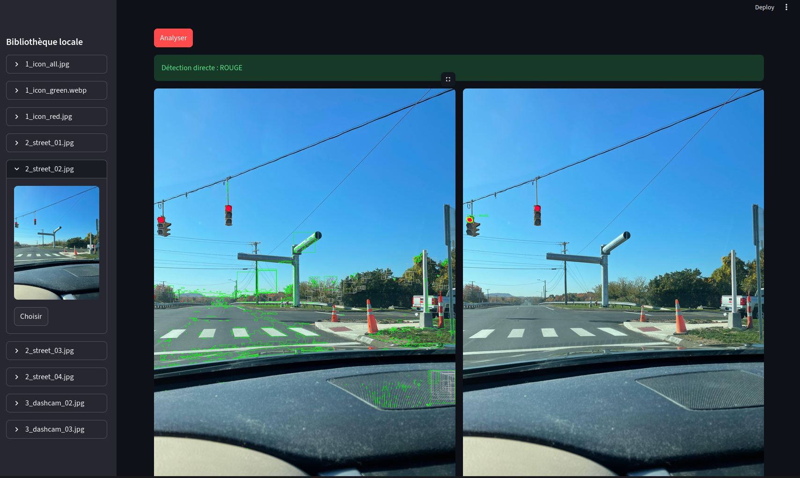

# Détection de feux de signalisation par vision classique

Détection et reconnaissance de l'état (rouge / vert) de feux de signalisation sans deep learning, uniquement avec OpenCV. 
Projet de traitement d'images, CY Tech, 2025.

**Pipeline :** segmentation couleur en HSV → nettoyage morphologique → filtrage des blobs lumineux par circularité → détection du boîtier (rectangles sombres filtrés par surface et ratio) → association blob / boîtier.

Interface Streamlit pour analyser les images et ajuster les paramètres en direct.



**Stack :** Python · OpenCV · NumPy · Streamlit

## Installation

1. **Cloner le projet**
```
   git clone https://github.com/ilyas157/traffic-light-opencv.git
   cd traffic-light-opencv
```

2. **Créer un environnement virtuel**
   * Windows :
```
     python -m venv venv
     .\venv\Scripts\activate
```
   * macOS / Linux :
```
     python3 -m venv venv
     source venv/bin/activate
```

3. **Installer les dépendances**
```
   pip install -r requirements.txt
```

Des images de test sont fournies dans `image/` ; vous pouvez y ajouter les vôtres.

## Lancement

```
streamlit run main.py
```
